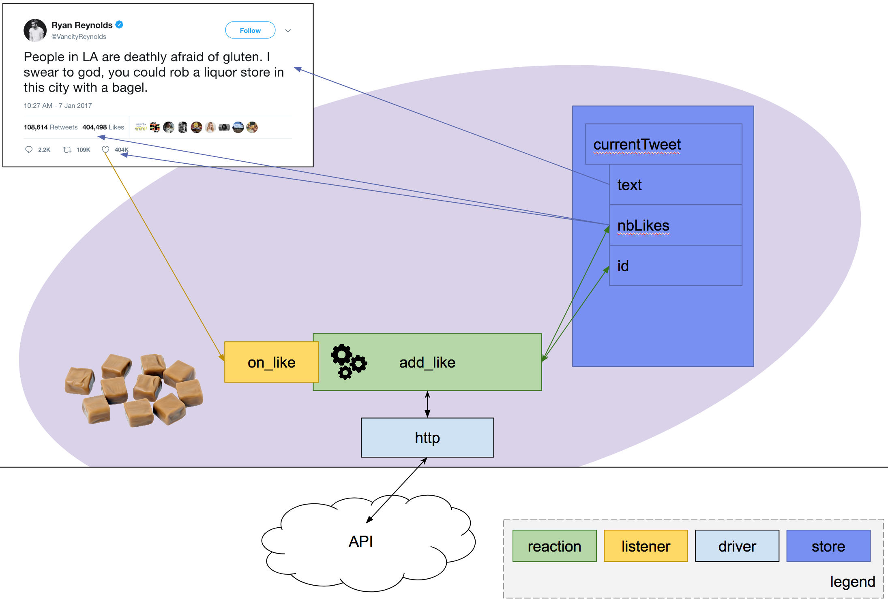

# Reactions

  main navigation 
   
  [&nbsp;
    <a href="../../../README.md#how-to-use-k-ramel">ecosystem documentation</a>&nbsp;|&nbsp;
    <a href="../README.md#how-to-use-k-ramel">core documentation</a>&nbsp;|&nbsp;
    <a href="../../../README.md#modules">modules</a>
  &nbsp;]

  sub navigation 
   
  [&nbsp;
    <a href="./LISTENERS.md">listeners</a>&nbsp;|&nbsp;
    <a href="./REACTIONS.md">reactions</a>&nbsp;|&nbsp;
    <a href="./DRIVERS.md">drivers</a>&nbsp;|&nbsp;
    <a href="./STORE.md">store</a>
  &nbsp;]

